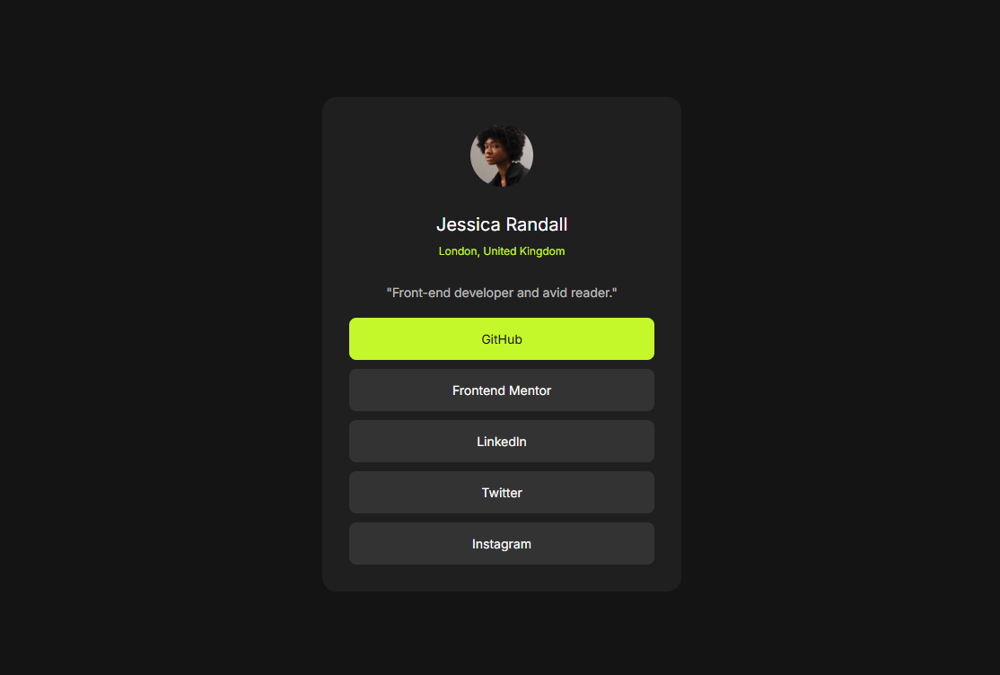

# Social Links Profile

## Live Demo
- **Live URL:** https://social-links-profile-vite.netlify.app/

## Screenshot

A simple solution to the Frontend Mentor **Social Links Profile** challenge.

## Built With
- Vite
- HTML5
- SCSS
- Mobile-first workflow

## What I Learned
- Building small UI components with semantic HTML
- Centering and styling using Flexbox
- Creating simple responsive layouts

## Author
- Frontend Mentor: https://www.frontendmentor.io
- Developer: hiticasmihai7@gmail.com
